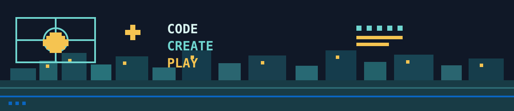

# Zakharia Drame

### Développeur logiciel · web · mobile

<strong>Étudiant en 3ème année de BUT Informatique</strong> 
Université d'Orléans · France

 

  

 

<a href="#projets"><strong>Explorer mes projets ↓</strong></a>

---

## Navigation

[À propos](#-à-propos-de-moi) · [Compétences](#-compétences) · [Expérience](#-expérience) · [Projets](#-projets) · [Formation](#-formation)

## 👋 À propos de moi

* 🎓 **Mes études :** Actuellement étudiant en 3ème année de BUT Informatique à l'Université d'Orléans.
* 🎯 **Mon ambition et ma recherche :** Mon but est de gravir les échelons et de me faire un nom dans la société. Pour l'instant, je suis activement à la recherche d'un stage en développement logiciel ou web d'une durée minimum de 14 à 16 semaines, à partir du **15 février 2027**.

## 🛠️ Compétences

Les logos sont cliquables et renvoient vers les documentations officielles.

### Langages

### Web, mobile et outils

**Autres technologies**  

<strong>Réseau & sécurité :</strong> Cryptographie · Wireshark · GNS3 · UML · Méthodes Agiles

## 💼 Expérience

| Période | Poste | Réalisation |
| --- | --- | --- |
| **avr. 2026 – juin 2026** Fontenay-sur-Eure | **Développeur full-stack — Stagiaire** Del Paysage | Conception et développement de **DELTIME**, un outil web pour le suivi des heures, du matériel et de la flotte de véhicules. |

## 📂 Projets

<table>
<tr>
<td width="33%" valign="top">

### ✈️ Suivi de vols

Application mobile avec carte interactive OpenStreetMap et API Flask.

`Flutter` `Dart` `Flask` `MVVM`

</td>
<td width="33%" valign="top">

### 🧬 Le Parc du Jurassique

Gestion de fouilles, plannings, matériel et traitement d'ADN.

`Python` `Flask` `SQL`

</td>
<td width="33%" valign="top">

### 📚 Vallès Lire !

Gestion de stocks avec base de données et travail en équipe.

`JavaFX` `JDBC` `MariaDB` `Oracle`

</td>
</tr>
</table>

## 🎓 Formation

**BUT Informatique** — Université d'Orléans *(depuis septembre 2024)*  
**Baccalauréat Général** — Mathématiques et Sciences de l'Ingénieur, Lycée Silvia Monfort *(2021–2024)*

---

### Une opportunité de stage ?

[📩 Me contacter](mailto:zakhariadrame@gmail.com) · [🐙 GitHub](https://github.com/ZDrame28) · [in LinkedIn](https://www.linkedin.com/in/zakharia-dram%C3%A9-100928353/)

 
<a href="#zakharia-drame">Retour en haut ↑</a>

